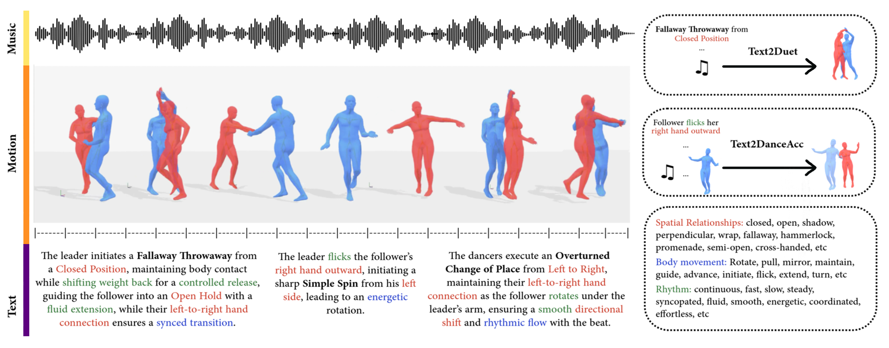
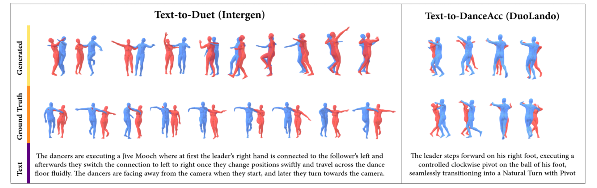
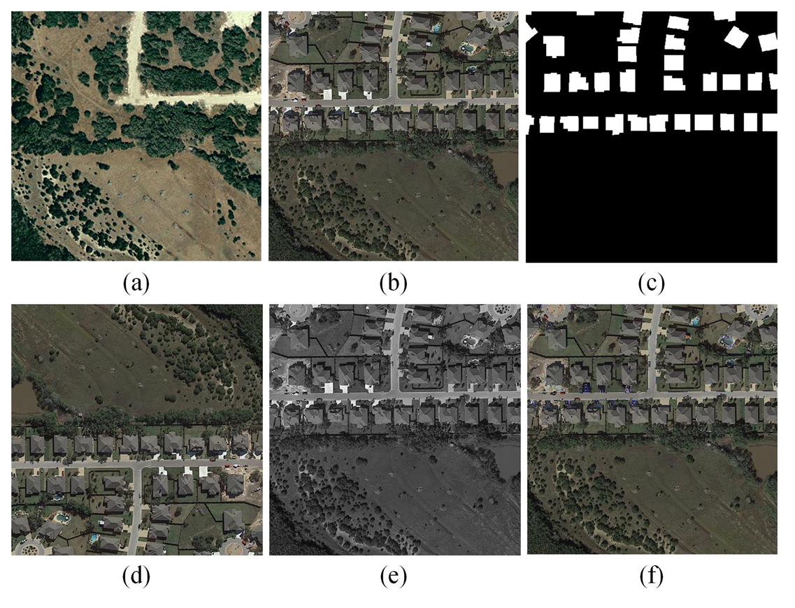
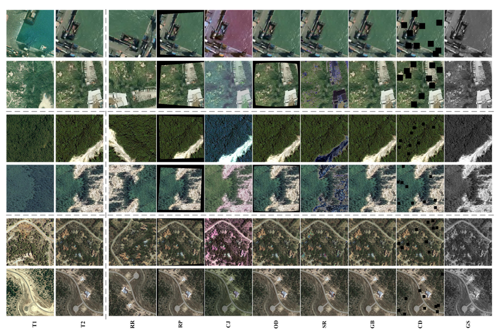
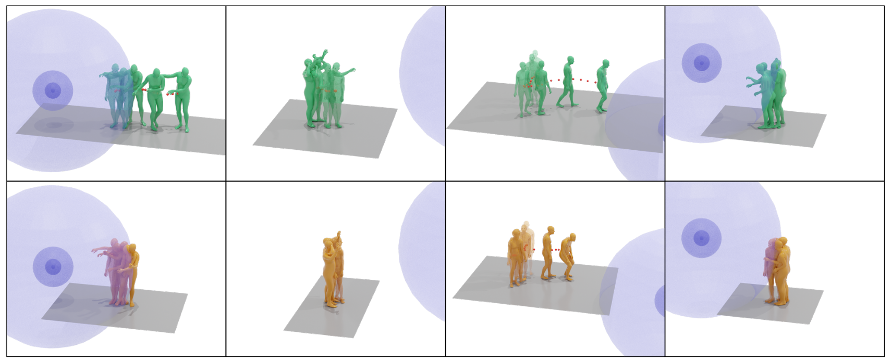
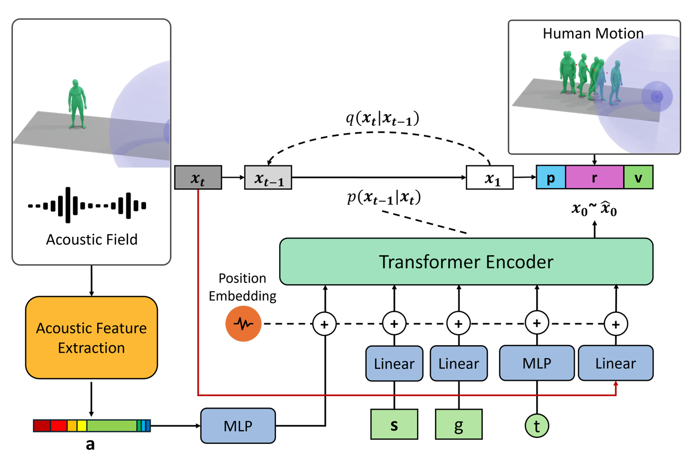

# Awesome-Open-Vision-Problem-Modeling
⭐Practical New Tasks and Inspiring Modeling Solutions for Diverse Open Vision Problems⭐

---

### 2025 | Historical Map Segmentation | ICDAR  
**Few-Shot Segmentation of Historical Maps via Linear Probing of Vision Foundation Models**  
Rafael Sterzinger, Marco Peer, Robert Sablatnig  
[Paper](https://arxiv.org/abs/2101.02144)

|  |  |
|:------------------------------------------------:|:------------------------------------------------:|
| **Task:** Historical map segmentation, aiming to parse scanned historical maps and segment meaningful cartographic or geographic elements such as railways, vineyards, and building blocks from visually heterogeneous map styles. | **Modeling:** The scanned historical map is treated as an image and its symbolic geographic content is converted into pixel-level semantic regions. |

### 2025 | MDD | ICCV
**MDD: A Dataset for Text-and-Music Conditioned Duet Dance Generation**  
Prerit Gupta, Jason Alexander Fotso-Puepi, Zhengyuan Li, Jay Mehta, Aniket Bera  
[Paper](https://arxiv.org/abs/2508.16911)/[Code](https://gprerit96.github.io/mdd-page/)

|  |                                                                                                                                                                            |
| :------------------------------------------------------------------------------------------------------: | :--------------------------------------------------------------------------------------------------------------------------------------------------------------------------------------------------------------------------------------------------------------------------------: |
| **Task:** Text-to-Duet for generating coordinated partner movements from a text description and music, and Text-to-Dance Accompaniment for synthesizing context-aware follower motion given the leader’s motion, music and text description.                                               | **Modeling:**  [MDM](https://arxiv.org/abs/2209.14916)/[InterGen](https://arxiv.org/abs/2304.05684)/[Duolando](https://arxiv.org/abs/2403.18811)

 ### 2025 | NRCD | IGARSS
**Non-Registration Change Detection: A Novel Change Detection Task and Benchmark Dataset**  
Zhe Shan, Lei Zhou, Liu Mao, Shaofan Chen, Chuanqiu Ren, Xia Xie  
[Paper](https://arxiv.org/abs/2505.09939)/[Code](https://github.com/ShanZard/NRCD)

|  |                                                                                                                                                                            |
| :------------------------------------------------------------------------------------------------------: | :--------------------------------------------------------------------------------------------------------------------------------------------------------------------------------------------------------------------------------------------------------------------------------: |
| **Task:**  Non-registration change detection.                                            | **Modeling:**  General change detection models.

### 2025 | MOSPA | arXiv
**MOSPA: Human Motion Generation Driven by Spatial Audio**  
Shuyang Xu, Zhiyang Dou, Mingyi Shi, Liang Pan, Leo Ho, Jingbo Wang, Yuan Liu, Cheng Lin, Yuexin Ma, Wenping Wang, Taku Komura  
[Paper](https://arxiv.org/abs/2507.11949)

|  |                                                                                                                                                                            |
| :------------------------------------------------------------------------------------------------------: | :--------------------------------------------------------------------------------------------------------------------------------------------------------------------------------------------------------------------------------------------------------------------------------: |
| **Task:** Human motion generation task centered on spatial audio-driven human motion synthesis.                                               | **Modeling:**  A diffusion-based generative framework (MOSPA)  captures the relationship between body motion and spatial audio through
 an effective fusion mechanism. |

### 2025 | EMind | arXiv
**EMind: A Foundation Model for Multi-task Electromagnetic Signals Understanding**  
Luqing Luo, Wenjin Gui, Yunfei Liu, Ziyue Zhang, Yunxi Zhang, Fengxiang Wang, Zonghao Guo, Zizhi Ma, Xinzhu Liu, Hanxiang He, Jinhai Li, Xin Qiu, Wupeng Xie, Yangang Sun  
[Paper](https://www.arxiv.org/pdf/2508.18785)/[Code](https://github.com/GabrielleTse/EMind)

|  |                                                                                                                                                                            |
| :------------------------------------------------------------------------------------------------------: | :--------------------------------------------------------------------------------------------------------------------------------------------------------------------------------------------------------------------------------------------------------------------------------: |
| **Task:** Multi-task Electromagnetic Signals Understanding.                                              | **Modeling:** EMind, an electromagnetic signals foundation model that bridges large scale pretraining and the unique nature of this modality based on the proposed first unified and largest standardized electromagnetic signal dataset covering multiple signal types and tasks. |

### 2025 | GraphDoc | ICLR
**Graph-based Document Structure Analysis**  
Yufan Chen, Ruiping Liu, Junwei Zheng, Di Wen, Kunyu Peng, Jiaming Zhang, Rainer Stiefelhagen  
[Paper](https://arxiv.org/pdf/2403.14442)/[Code](https://github.com/yufanchen96/GraphDoc)

|  |  |
|:--------------------------------------------------:|:--------------------------------------------------:|
| **Task:** Graph-based Document Structure Analysis. | **Modeling:** Document Relation Graph Generator(DRGG) combines object detection with relation prediction, capturing both spatial and logical relatioins between document elements.|

### 2025 | Paper2Poster | arXiv
**Paper2Poster: Towards Multimodal Poster Automation from Scientific Papers**  
Wei Pang, Kevin Qinghong Lin, Xiangru Jian, Xi He, Philip Torr  
[Paper](https://arxiv.org/abs/2505.21497)/[Code](https://github.com/Paper2Poster/Paper2Poster)

|  |  |
|:--------------------------------------------------:|:--------------------------------------------------:|
| **Task:** Automatic academic poster generation from long-context scientific papers. | **Modeling:**  PosterAgent, a visual-in-the-loop multi-agent pipeline with parsing, binary-tree layout planning, and iterative VLM-guided rendering refinement.|

### 2025 | DiffSensei | CVPR
**DiffSensei: Bridging Multi-Modal LLMs and Diffusion Models for Customized Manga Generation**  
Jianzong Wu, Chao Tang, Jingbo Wang, Yanhong Zeng, Xiangtai Li, Yunhai Tong  
[Paper](https://arxiv.org/abs/2412.07589)/[Code](https://github.com/jianzongwu/DiffSensei)

|  |  |
|:--------------------------------------------------:|:--------------------------------------------------:|
| **Task:** Customized manga generation with dynamic multi-character control from text. | **Modeling:**  Diffusion–MLLM hybrid framework using a text-compatible identity adapter and masked cross-attention for precise character and layout control.|

### 2025 | LLada | ICCV
**Where, What, Why: Towards Explainable Driver Attention Prediction**  
 Yuchen Zhou, Jiayu Tang, Xiaoyan Xiao, Yueyao Lin, Linkai Liu, Zipeng Guo, Hao Fei, Xiaobo Xia, Chao Gou  
[Paper](https://arxiv.org/pdf/2506.23088)/[Code](https://github.com/yuchen2199/Explainable-Driver-Attention-Prediction)

|  |  |
|:--------------------------------------------------:|:--------------------------------------------------:|
| **Task:** Explainable Driver Attention Prediction that identifies where drivers look, what they attend to, and why. | **Modeling:**  LLada, an LLM-driven framework integrating pixel-level attention, semantic parsing, and causal reasoning in an end-to-end model.|

### 2025 | DiffHDR | AAAI  
**Predicting the Original Appearance of Damaged Historical Documents**  
 Zhenhua Yang, Dezhi Peng, Yongxin Shi, Yuyi Zhang, Chongyu Liu, Lianwen Jin  
[Paper](https://arxiv.org/pdf/2412.11634)/[Code](https://github.com/yeungchenwa/HDR)

|  |  |
|:--------------------------------------------------:|:--------------------------------------------------:|
| **Task:** Historical Document Repair to reconstruct the original appearance of damaged historical texts. | **Modeling:**  Diffusion-based DiffHDR with semantic–spatial guidance and character perceptual loss for coherent restoration.|

### 2025 | Rose4D | CVPR  
**Birth and Death of a Rose**  
 Chen Geng, Yunzhi Zhang, Shangzhe Wu, Jiajun Wu  
[Paper](https://arxiv.org/abs/2412.05278)

|  |  |
|:--------------------------------------------------:|:--------------------------------------------------:|
| **Task:** Generation of temporally evolving 3D object intrinsics from pretrained 2D models. | **Modeling:**  Neural Template–guided temporal-state distillation from 2D diffusion features for consistent multi-view, multi-time rendering.|

### 2025 | GFlow | AAAI  
**GFlow: Recovering 4D World from Monocular Video**  
 Shizun Wang, Xingyi Yang, Qiuhong Shen, Zhenxiang Jiang, Xinchao Wang  
[Paper](https://arxiv.org/pdf/2405.18426)/[Code](https://github.com/littlepure2333/gflow)

|  |  |
|:--------------------------------------------------:|:--------------------------------------------------:|
| **Task:** 4D scene reconstruction from a single monocular video without camera parameters. | **Modeling:**  2D-prior-guided 4D Gaussian flow with alternating pose and dynamics optimization.|

### 2025 | VecFormer | arXiv  
**Point or Line? Using Line-based Representation for Panoptic Symbol Spotting in CAD Drawings**  
 Xingguang Wei∗, Haomin Wang∗, Shenglong Ye, Ruifeng Luo, Yanting Zhang, Lixin Gu, Jifeng Dai, Yu Qiao, Wenhai Wang, Hongjie Zhang  
[Paper](https://arxiv.org/pdf/2505.23395)

|  |  |
|:--------------------------------------------------:|:--------------------------------------------------:|
| **Task:** Computer-aided design (CAD) drawings. | **Modeling:** Type-agnostic and expressive line-based representation.|

### 2025 | SimGen | arXiv  
**SIMGEN: A DIFFUSION-BASED FRAMEWORK FOR SIMULTANEOUS SURGICAL IMAGE AND SEGMENTATION MASK GENERATION**  
 Aditya Bhat, Rupak Bose, Chinedu Innocent Nwoye, Nicolas Padoy  
[Paper](https://arxiv.org/pdf/2501.09008)

|  |  |
|:--------------------------------------------------:|:--------------------------------------------------:|
| **Task:** Simultaneous generation of surgical images and corresponding segmentation masks. | **Modeling:** Diffusion-based framework with cross-correlation priors and Canonical Fibonacci Lattice for aligned image–mask synthesis.|

### 2024 | PanAf20K | IJCV
**PanAf20K: A Large Video Dataset for Wild Ape Detection and Behaviour Recognition**  
Otto Brookes, Majid Mirmehdi, Colleen Stephens, Samuel Angedakin,
 Katherine Corogenes, Dervla Dowd, Paula Dieguez, Thurston C. Hicks,
 Sorrel Jones, Kevin Lee, Vera Leinert, Juan Lapuente,
 Maureen S. McCarthy, Amelia Meier, Mizuki Murai, Emmanuelle Normand,
 Virginie Vergnes, Erin G. Wessling, Roman M. Wittig, Kevin Langergraber,
 Nuria Maldonado, Xinyu Yang, Klaus Zuberb¨uhler, Christophe Boesch,
 Mimi Arandjelovic, Hjalmar K¨uhl, Tilo Burghardt
   
[Paper](https://arxiv.org/pdf/2401.13554)/[Code](https://obrookes.github.io/panaf.github.io/)

|  |  |
|:--------------------------------------------------:|:--------------------------------------------------:|
| **Task:**  Wild Ape Detection and Behaviour Recognition. | **Modeling:** Object Detection + Behavioural Action Recognition.|

### 2024 | NIGHTTIME OPTICAL FLOW | ICLR  
**EXPLORING THE COMMON APPEARANCE-BOUNDARY ADAPTATION FOR NIGHTTIME OPTICAL FLOW**  
Hanyu Zhou, Yi Chang, Haoyue Liu, Wending Yan, Yuxing Duan, Zhiwei Shi, Luxin Yan  
[Paper](https://arxiv.org/abs/2401.17642)

|  |  |
|:--------------------------------------------------:|:--------------------------------------------------:|
| **Task Definition:** Nighttime optical flow estimation. | **Modeling:** Cross-domain motion alignment. |

### 2024 | OVCoser | ECCV  
**Open-Vocabulary Camouflaged Object Segmentation**  
 Youwei Pang*, Xiaoqi Zhao*, Jiaming Zuo, Lihe Zhang, Huchuan Lu  
[Paper](https://arxiv.org/pdf/2405.19423)/[Code](https://github.com/YouweiPang/OVCOS)

|  |  |
|:---------------------------------------------:|:----------------------------------------------:|
| **Task:** open-vocabulary camouflaged object segmentation. | **Modeling:**  open-set recognition and camouflage-aware segmentation. |

### 2024 | PaSCo | CVPR  
**PaSCo: Urban 3D Panoptic Scene Completion with Uncertainty Awareness**  
Anh-Quan Cao, Angela Dai, Raoul de Charette  
[Paper](https://arxiv.org/pdf/2312.02158)/[Code](https://astra-vision.github.io/PaSCo/)

|  |  |
|:---------------------------------------------:|:----------------------------------------------:|
| **Task:** Urban 3D panoptic scene completion with instance-level understanding and uncertainty estimation. | **Modeling:**  Hybrid mask-based PSC with MIMO ensembling for voxel- and instance-wise uncertainty. |

### 2024 | PBD | CVPR  
**Towards Automatic Power Battery Detection: New Challenge, Benchmark Dataset and Baseline**  
Xiaoqi Zhao*, Youwei Pang*, Zhenyu Chen, Qian Yu, Lihe Zhang, Hanqi Liu, Jiaming Zuo, Huchuan Lu  
[Paper](https://arxiv.org/pdf/2312.02528v2)/[Code](https://github.com/Xiaoqi-Zhao-DLUT/X-ray-PBD)

|  |  |
|:---------------------------------------------:|:----------------------------------------------:|
| **Task:** Fine-grained detection of battery plates from X-ray/CT images. | **Modeling:**  Multi-dimensional collaborative framework (point, line, number). |

### 2023 | Crater Detection | arXiv
**Deep Learning based Systems for Crater Detection: A Review**
Atal Tewari, K. Prateek, Amrita Singh, Nitin Khanna
[Paper](https://arxiv.org/abs/2310.07727)

|  |                                                                                     |
| :------------------------------------------------------------------------------------------------------- | :-----------------------------------------------------------------------------------------------------------------------------------------------------------------------------------------: |
| **Task:** Crater detection on lunar digital elevation maps (DEMs).                                       | **Modeling:** It can be formulated as candidate-region classification, crater-mask segmentation with post-processing, or direct object detection for estimating crater locations and sizes. |

NOTE: *The planetary data mainly used for crater detection are digital orthophoto maps (DOMs), digital elevation maps (DEMs), and near IR images. These data’s characteristics differ from one another, such as DOMs and infrared images are affected by sun angle and cause highlight and shadow patterns. In contrast, DEMs are unaffected but lack complex terrain information.*

### 2023 | WireSegHR | CVPR  
**Automatic High Resolution Wire Segmentation and Removal**  
Mang Tik Chiu, Xuaner Zhang, Zijun Wei, Yuqian Zhou, Eli Shechtman, Connelly Barnes, Zhe Lin, Florian Kainz, Sohrab Amirghodsi, Humphrey Shi  
[Paper](https://openaccess.thecvf.com/content/CVPR2023/papers/Chiu_Automatic_High_Resolution_Wire_Segmentation_and_Removal_CVPR_2023_paper.pdf)/[Code](https://github.com/adobe-research/auto-wire-removal)

|  |  |
|:-------------------------------------------------:|:-------------------------------------------------:|
| **Task:**  Wire segmentation in high-res images. | **Modeling:**  Thin-structure semantic segmentation. |

### 2023 | TSI | arXiv  
**Traffic Sign Interpretation in Real Road Scene**  
Chuang Yang, Kai Zhuang, Mulin Chen, Haozhao Ma, Xu Han, Tao Han, Changxing Guo, Han Han, Bingxuan Zhao, Qi Wang  
[Paper](https://arxiv.org/pdf/2311.10793)

|  |  |
|:-----------------------------------------------:|:-----------------------------------------------:|
| **Task:** Traffic sign interpretation. | **Modeling:** Textual interpretation of traffic scenarios via logical reasoning. |

### 2022 | IOD | CVPR  
**Explore Spatio-temporal Aggregation for Insubstantial Object Detection: Benchmark Dataset and Baseline**  
Kailai Zhou, Yibo Wang, Tao Lv, Yunqian Li, Linsen Chen, Qiu Shen*, Xun Cao*  
[Paper](https://openaccess.thecvf.com/content/CVPR2022/papers/Zhou_Explore_Spatio-Temporal_Aggregation_for_Insubstantial_Object_Detection_Benchmark_Dataset_and_CVPR_2022_paper.pdf)/[Code](https://github.com/CalayZhou/IOD-Video)

|  |  |
|:---------------------------------------------:|:---------------------------------------------:|
| **Task:**  Insubstantial object detection. | **Modeling:** Voxel-based shift field models motion and spatial uncertainty. |

### 2022 | CCSE | arXiv  
**Instance Segmentation for Chinese Character Stroke Extraction, Datasets and Benchmarks**  
Lizhao Liu*, Kunyang Lin, Shangxin Huang, Zhongli Li, Chao Li, Yunbo Cao, and Qingyu Zhou  
[Paper](https://arxiv.org/pdf/2210.13826)/[Code](https://github.com/lizhaoliu-Lec/CCSE)

|  |  |
|:------------------------------------------------:|:------------------------------------------------:|
| **Task:**  Chinese character stroke extraction. | **Modeling:** Stroke-level instance segmentation. |
